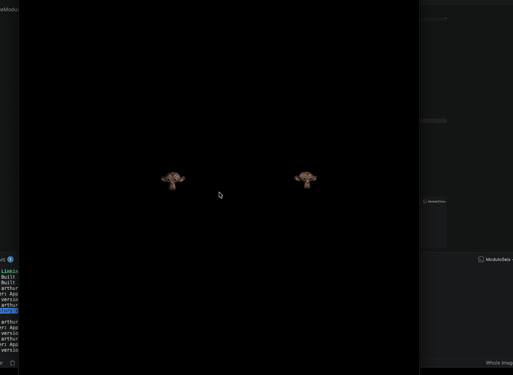
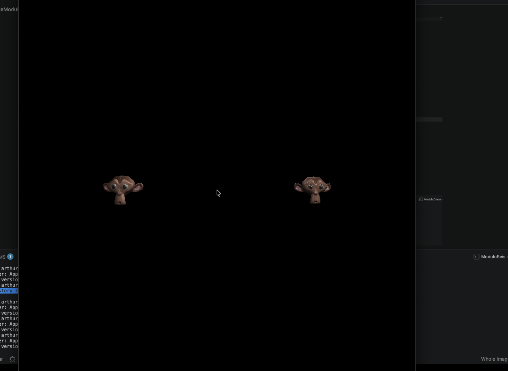
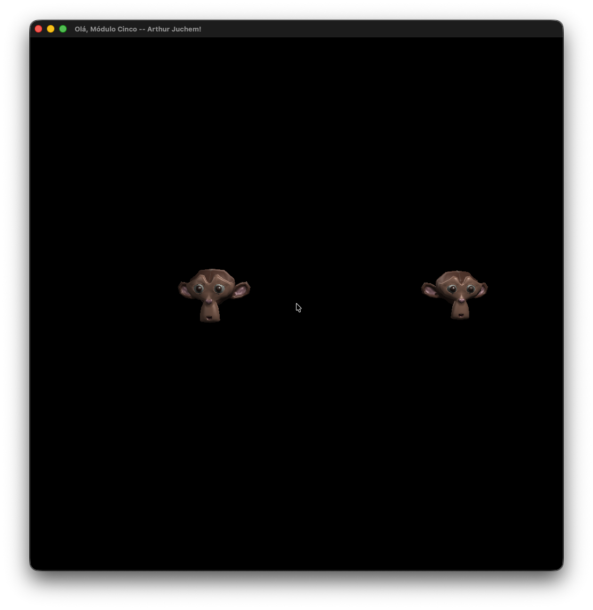

### Resultado M1

### Resultado M2

### Resultado M3

### Resultado M4
(Trabalho da vivencial)

### Resultado M5
(Trabalho da vivencial)

WASD - Movimenta
Mouse - Camêra

### Resultado M6

WASD - Movimenta
Mouse - Camêra
Tab - Seleciona outro objeto
Setas - Movimenta objeto selecionado
P - Marca ponto da rota do objeto selecionado
Space - Inicia/Para rota do objeto selecionado